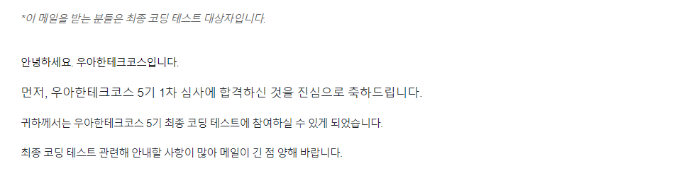
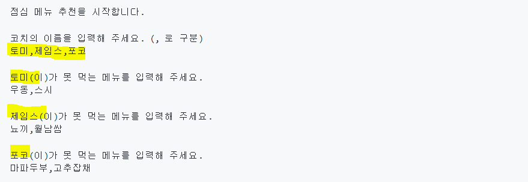
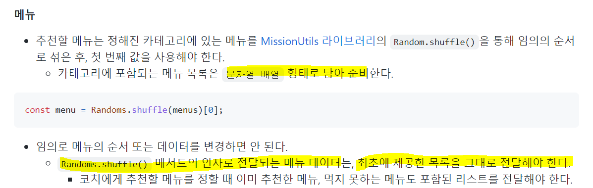

## 1차 합격 !!

프리코스가 끝나고 결과를 기다리는 3주 동안 지난 문제에 대한 복습, 리팩토링, 코드 리뷰를 하는 스터디를 했었다. 그런데 ...!



다행히 1차 합격을 하고 3주 동안 최종 코딩테스트를 위해 준비했던 시간이 헛되이지 않게 되었다.

1차 합격만으로 너무 기뻤지만 3일 뒤 마지막 관문인 최종 코딩테스트가 남아있었다.

메일을 받고 급히 이전 기수분들의 문제와 프리코스 문제를 실전처럼 시간을 재고 다시 풀어보는 연습을 매일 했다.

그리고 대망의 시험날 아주 충격적인 실수를 하게 된다.

## 충격의 최종 코테 소감 😂

fork하고 clone 한 뒤 브랜치를 따로 생성하지 않고 main 브랜치에다가 작업을 하고 있었던 것을 제출할 때 발견했던 것이다.

연습때 한번도 안해본 실수여서 메인 브랜치에서 새로운 브랜치로 옮기는 방법을 몰랐고 급히 구글링을 해서 해결해보려다가 오류가 발생해서 아예 PR을 날릴 수가 없는 상황이 되어버렸었다..

연습할 때 기능 구현 하는데 시간이 부족했다보니 처음 시작할 때 마음이 정말 조급했던 것 같다.

부정행위를 할 수는 없기에 아무한테 도움도 못청하고 6시까지 끙끙대다가 끝나고 코치님한테 달려가서 사정을 말씁드렸더니 메일로라도 보내라고 해주셨다.

하지만 난 이미 불합격을 직감했고, 시간이 지나 지원하기 플랫폼에는 제출하지 못한채 울면서 시험장을 나왔다.

이 사실을 블로그에 쓰는 것도 정말 부끄럽지만 혹시라도 다음 기수분들이 이 글을 보게 된다면 나 같은 실수는 하지 않았으면 하는 마음에 이 글을 적는다.

[제출방법 링크](https://github.com/woowacourse/woowacourse-docs/tree/main/precourse)

위 링크를 시험 전날에 요약해서 어딘가 적어가거나 이 링크를 꼭 시험 시작 전에 보고 하는 것을 추천한다.

{: .notice} fork => clone => git branch 브랜치명 => git checkout 브랜치명

## 점메추 최종 코딩 테스트 문제 후기

그리고 사실 제출을 떠나서 최종 코딩 테스트 문제를 시간 내에 푸는 것이 나에겐 너무 어려웠다.

[점심 메뉴 추천 미션 링크](https://github.com/woowacourse-precourse/javascript-menu)

기능 구현을 거의 반 정도밖에 못했고, 절대적으로 시간의 부족함과 내 실력의 부족함을 체감했다.

사실 처음에 문제를 보고 문제 자체를 이해하는데는 어려움이 없었어서 구현이 가능할것만 같았다.



하지만 두번째 입력을 받는 부분에서 문제가 발생해서 거의 1시간 이상을 잡아먹었다.

```javascript
 readMoving(movingSpaceCallback) {
    Console.readLine('이동할 칸을 입력하세요.', (space) => {
      movingSpaceCallback(space)
    })
  },
```

이제껏 미션에서는 입력의 문자열은 위처럼 문자열 상수로 넣어주면 되었다.

그런데 이번에는 코치의 명수만큼 코치 이름을 입력문에 인자로 넣어 콜백함수로 계속 호출해야 했다.

```javascript
readAvoidMenu(name, readAvoidMenuCallback) {
    Console.readLine(`${name}(이)가 못 먹는 메뉴를 입력해 주세요.\n`, (menu) => {
      readAvoidMenuCallback(menu);
    })
  },
```

처음에는 코치 이름이 담긴 배열의 길이만큼 반복하게끔 하려고 고차함수를 계속 이용했었다.

그런데 콜백 함수가 종료되지 않으니 반복 루프가 돌 수 없다는 것을 깨달았고 다른 방법으로 문제를 어떻게 해결할지 고민하다가 다리 건너기 게임에서 힌트를 얻었다.

입력받은 코치 이름 배열을 클래스에 변수로 할당하고 코치 인덱스번호를 클래스의 constructor 내부에서 0으로 설정해준 뒤, 콜백함수가 실행될 때마다 인덱스 번호를 증가시켜서 각 코치 이름을 입력 문자열에 넣어줄 수 있었다.

```javascript
 readEachCoachAvoidMenu(name) {
    InputView.readAvoidMenu(name, (menu) => {
      this.coachAvoidMenu[this.coach[this.coachIndex]] = menu;
      this.coachIndex++;
      if (this.coachIndex === this.coach.length) return this.recommendCategory();
      this.readEachCoachAvoidMenu(this.coach[this.coachIndex]);
    });
  }
```

간신히 이 문제를 해결했지만 또 산 넘어 산이었다.

다음에는 우테코에서 제공하는 MissionUtils의 shuffle 메서드를 사용하던 중 문제가 발생했다.



요구사항에서 Randoms.shuffle()메서드의 인자로 전달되는 메뉴 데이터는 최초에 제공한 목록을 그대로 전달한다고 하였고, 카테고리에 포함되는 메뉴 목록은 문자열 배열 형태로 담아 준비한다고 했기 때문에 난 당연히 menus에 문자열 메뉴 목록을 전달해야 한다고 생각했다.

그런데 실행을 시키면 `arguments must be numbers.`라는 오류가 발생했고 왜 숫자여야 한다는 거지?!? 하며 shuffle 메서드의 코드가 어떻게 짜여져 있는지 MissionUtils 파일에 들어가보았다.

```javascript
  static shuffle(array) {
    Random.#validateEmptyArray(array);

    return array.sort(() => Math.random() - 0.5);
  }

  static #validateEmptyArray(array) {
    if (!Array.isArray(array)) {
      throw new Error("the argument must be an array.");
    }

    if (!array.every((v) => Random.#isNumber(v))) {
      throw new Error("array elements must be numbers.");
    }

    if (array.length === 0) {
      throw new Error("argument array cannot be empty.");
    }
  }
```

`#validateEmptyArray(array)`의 코드를 보면 문자열을 넣으면 error가 발생하게끔 짜여져 있었다.

그래서 아래와 같이 메뉴 목록의 개수만큼 배열을 만들어서 shuffle 메서드에 넣어주었다.

```javascript
const menus = SAMPLE[category].split(",");
const menuNumber = [];
for (let i = 0; i < menus.length; i++) {
  menuNumber.push(i + 1);
}
const menu = Random.shuffle(menuNumber)[0];
return menus[menu];
```
혹시나 내가 잘못 이해했나 싶어 요구사항의 단어 하나하나 곱씹으며 다시 읽어보았는데도 아직까지 왜 요구사항이 이렇게 주어졌는지에 대해 의문이 해결되지는 않았다.

아마도 요구사항이 애매해도 알아서 오류없이 구현하라는 메세지를 주신게 아닐까 싶다.

최종적으로 이 두 문제와 브랜치를 안 만든 실수 때문에 더 이상 기능을 구현하지 못했고 카테고리에 맞는 메뉴를 추천해주는 기능까지 구현하고 시험이 끝났다.

---

치명적인 실수 때문에 한 이틀동안은 멘탈이 나가있었는데 이제는 다시 이겨내고 개발 공부에 집중해보려 한다.

오히려 최종 시험을 보고 나니 합격을 기대하기 보다는 아직 너무 부족한 실력과 경험들을 채워나가고 싶어졌다.

1차 코딩테스트가 없어져서 프리코스를 참여할 수 있다는 자체만으로 행복했고 심지어 1차 합격이라는 쾌거를 이룬 것도 너무 뿌듯했다.

프리코스 동안 javascript 언어를 깊이있게 다룰 뿐만 아니라 디자인 패턴, 코딩 컨벤션, 코드 리뷰 등을 통해 실제 좋은 개발 문화를 체험해본 듯한 느낌도 들었고 앞으로 개발 공부를 함에 있어서 우테코 프리코스가 좋은 발판이 될 것 같다.